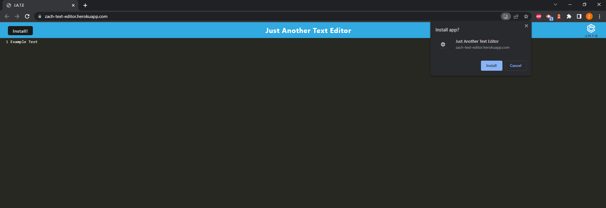

# Just Another Text Editor

## JATE

## Description

This application is a simple text editor that can be used in the browser or installed and used as an application on the client computer independent of an internet connection.

## Technologies Used

This application was built using HTML, CSS, JavaScript, Express, Node, and Webpack. Webpack allows this application to be installed locally on the computer.

## Application Links

Deployed Heroku Application: https://zach-text-editor.herokuapp.com/

GitHub Repo: https://github.com/wobbledy/text-editor

## Application Screenshot

